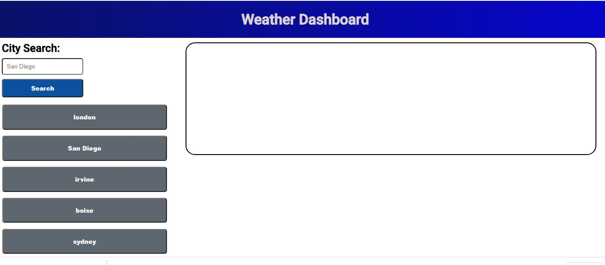
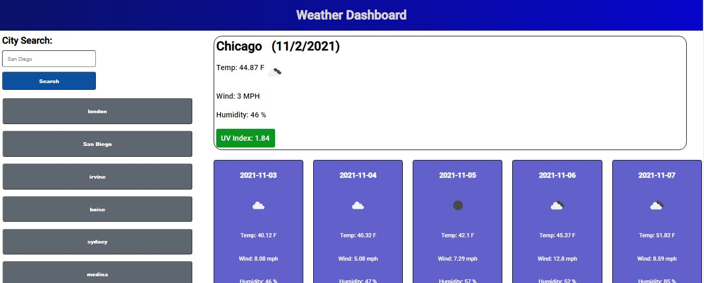
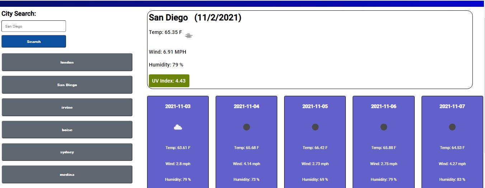

Link to deployed website: https://asharif123.github.io/weather-dashboard/

Weather Dashboard is a website where users can look up weather information by typing in a city.

The user can also view the 5 day forecast for that particular city and searched cities can be viewed in search history.

This was created using HTML, CSS and Javascript where Javascript was used to fetch weather information from the OpenWeather API to display current weather/5 day forecast.

